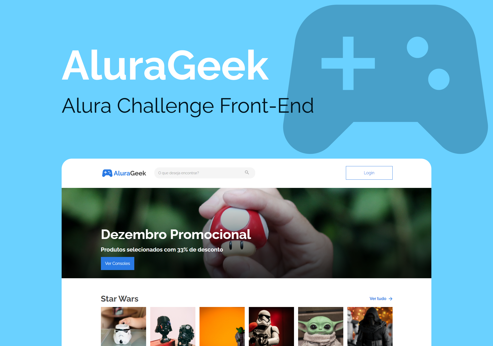

<h1 align="center">
    <br>
    
</h1>

<h4 align="center">
    Alura Challenge Front-End 🤿
</h4>

<p align="center">
    
    
    
    
</p>

<h1 align="center">
    
</h1>

<h3 align="center">
    🚧 Em desenvolvimento 🚧
</h3>

# AluraGeek 
A empresa AluraGeek está precisando trazer mais clientes e aumentar suas vendas, para isso desejam implementar um e-commerce e levar a empresa ao próximo patamar, se tornar mais digital. 🚀

## 🧪 Tecnologias

Esse projeto foi desenvolvido com as seguintes tecnologias:

- [React](https://reactjs.org)
- [TypeScript](https://www.typescriptlang.org/)
- [Vite](https://vitejs.dev/)
- [styled component](https://styled-components.com/)

## 🚀 Como executar

Clone o projeto e acesse a pasta do mesmo.

```bash
$ git clone https://github.com/pejamp/alurageek-alurachallenge
$ cd alurageek-alurachallenge
```

Para iniciá-lo, siga os passos abaixo:
```bash
# Instalar as dependências
$ npm install

# Iniciar o projeto
$ npm run dev
```
O app estará disponível no seu browser pelo endereço http://localhost:3000.

## 💻 Projeto
- [Acesse o site AluraGeek]()

## 📝 License

Esse projeto está sob a licença MIT. Veja o arquivo [LICENSE](LICENSE.md) para mais detalhes.

## ✒️ Author

<a href="https://github.com/pejamp">
 
 <br />
 <sub><b>Pedro Rodrigues</b></sub>
</a> 
 <br />

👋🏽 Contact me!

[](https://www.linkedin.com/in/pedro-j%C3%A2nio-rodrigues-abreu-3a3647176/) 
[](mailto:pedro.roguea@gmail.com)
